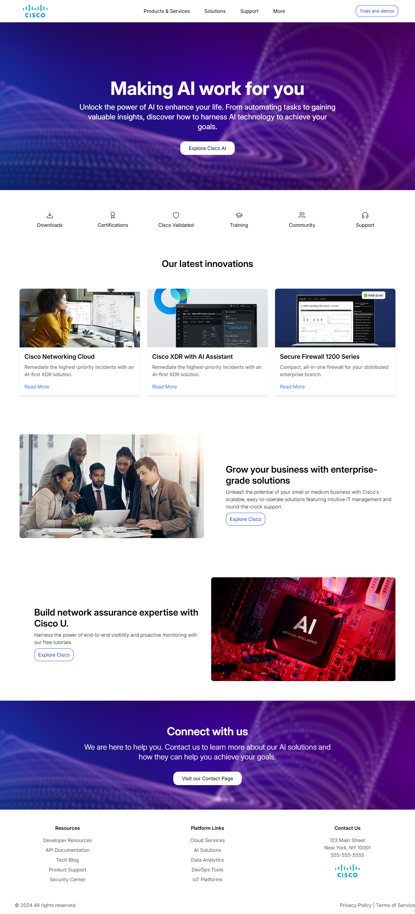

# Tech website landing page | Cisco.com UI Redesign

Tech website landing page using React, Tailwind CSS, Framer Motion, Material UI, and Lucide icons, with integrated Google Maps. This is a redesign of the Cisco.com website with a modern UI.

## Technologies Used

- **React**: JavaScript library for building user interfaces.
- **Lucide Icons**: A collection of icons used for enhancing the visual design.
- **Tailwind CSS**: A utility-first CSS framework for styling.
- **Framer Motion**: A library for animations and transitions in React.

## Screenshot

## Acknowledgements

- **React**: [React Documentation](https://reactjs.org/docs/getting-started.html)
- **Lucide Icons**: [Lucide Icons](https://lucide.dev/)
- **Tailwind CSS**: [Tailwind CSS Documentation](https://tailwindcss.com/docs)
- **Framer Motion**: [Framer Motion Documentation](https://www.framer.com/api/motion/)

Feel free to open issues or submit pull requests if you have any suggestions or improvements.